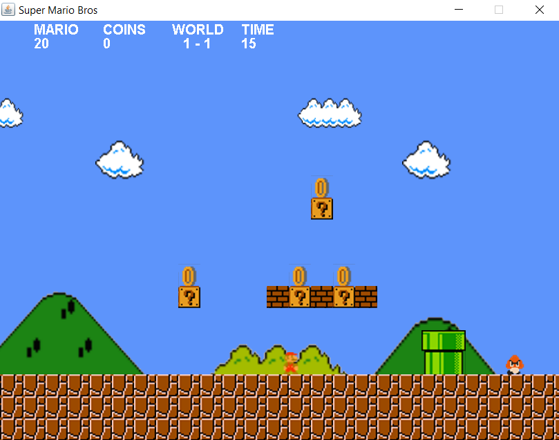
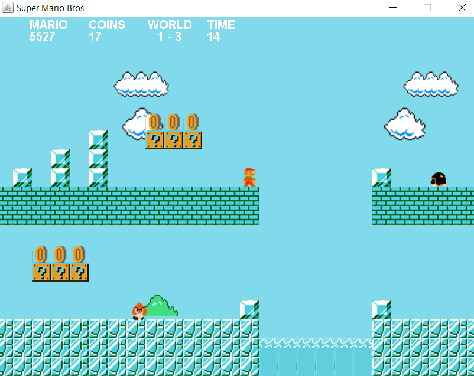

# Super Mario Bros Clone

This project is a minor clone of SMB with custom levels implemented in Java Swing. To play Audio files in my game, I used the Slick2D library.

## Instructions
The main objective of this game is to rescue the princess with the maximum score as possible. There are 4 levels in this game, each having a time limit of 60 seconds. The player has to complete a level within these 60 seconds. The score obtained at the end of each level is multiplied by the square root of the remaining time. So time is a very important factor to take into account.

#### How can you score points?
* By collecting coins.
* Killing an enemy by shooting a fireball at it.

#### How can Mario Die?
* By coming into direct contact with any enemy.
* By falling into water, lava or off the cliff.
* By not completing a level within 60 seconds.

#### User Controls
* The up arrow key or spacebar to jump.
* The down arrow key to shoot fireballs.
* The left and right arrow keys to move left and right respectively.

## Screen Shots

  

